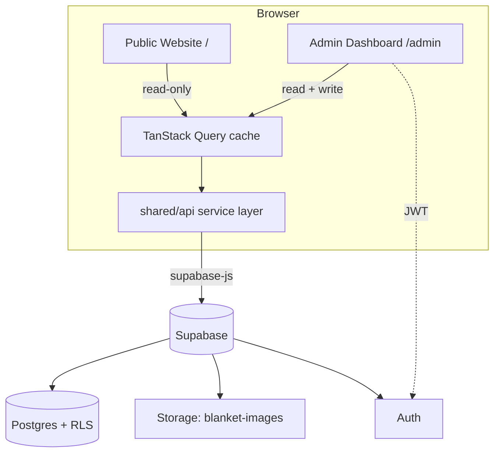
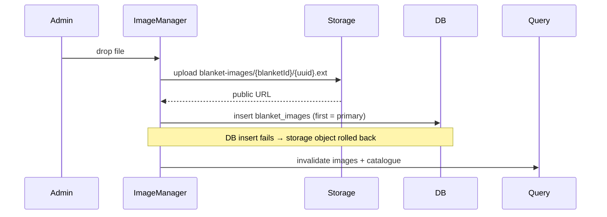

# Nile Overseas — Blanket Manufacturing Platform

A production-ready platform for **Nile Overseas**, combining a premium public
website with a full admin dashboard (catalogue, inventory, production tracking,
monthly stock, sales reports and CMS) over a single Supabase backend.

- **Public website** (`/`) — browse the DRJ and Cloud9 blanket ranges. No login.
- **Admin dashboard** (`/admin`) — Supabase-authenticated staff manage everything
  without touching the database. No public signup.

---

## Tech stack

| Layer      | Choice |
|------------|--------|
| Frontend   | React 18, TypeScript, Vite, React Router 6, Tailwind, shadcn-style UI |
| Data       | TanStack Query (server state), React Hook Form + Zod (forms) |
| Backend    | Supabase — Postgres, Auth, Storage, Row Level Security |
| Charts     | Recharts |
| Deployment | Vercel (SPA) |

---

## Architecture

Single Vite app, two experiences, one shared data layer.



### Folder structure

```
src/
  shared/            # cross-cutting, imported by both experiences
    api/             # pure async data functions (supabase calls)
    hooks/           # TanStack Query + auth hooks wrapping the api layer
    lib/             # supabase client, query client + query keys
    types/           # generated DB types + domain models
    utils/           # cn(), formatters
    components/ui/    # shadcn-style primitives (button, card, table…)
  website/           # public site — layout, components, pages
  admin/             # admin — guard, layout, components, pages
```

### Data flow

`page → hook (useX) → api function → supabase-js → Postgres (RLS enforced)`.
Mutations invalidate the relevant query keys, so the **public site updates the
moment an admin saves** — no manual cache wiring, no redeploy.

### Authentication flow

```mermaid
sequenceDiagram
    Admin->>LoginPage: email + password
    LoginPage->>Supabase Auth: signInWithPassword
    Supabase Auth-->>AuthProvider: session (JWT)
    AuthProvider->>ProtectedRoute: session present
    ProtectedRoute->>AdminLayout: render
    Note over Supabase Auth: JWT sent on every request;<br/>RLS checks auth.role() = 'authenticated'
```

- Session persisted in `localStorage`, auto-refreshed by supabase-js.
- `AuthProvider` exposes `{ session, loading, signIn, signOut }`.
- `ProtectedRoute` gates `/admin/*` and redirects to `/admin/login`.

### Security & Row Level Security

RLS is enabled on every table. The model:

| Table            | Public (anon)                    | Admin (authenticated) |
|------------------|----------------------------------|-----------------------|
| products (brands)| read all                         | full |
| blankets         | read where `is_active = true`    | full |
| blanket_images   | read (only for active blankets)  | full |
| monthly_stock    | none                             | full |
| site_settings    | read                             | update |
| storage objects  | read `blanket-images`            | write/delete |

Server-side invariants (not trusted to the client):
- **SKU** auto-generated per brand via trigger (`DRJ-001`, race-safe row lock).
- **Closing stock** is a generated column: `opening + production − sales`.
- **Locked months** — a trigger blocks edits to `opening/production/sales`.
- `updated_at` maintained by trigger; functions pinned `search_path`;
  reporting view is `security_invoker`.

### Image upload workflow



---

## Getting started

```bash
npm install
cp .env.example .env      # already points at the Nile Overseas project
npm run dev               # http://localhost:5173  (admin at /admin)
npm run build             # typecheck + production build
```

### Environment variables

| Var | Value |
|-----|-------|
| `VITE_SUPABASE_URL` | `https://nstwdxgrefzzqozuvejy.supabase.co` |
| `VITE_SUPABASE_ANON_KEY` | publishable key (safe for the browser; RLS enforces access) |

### Admin login

An admin account was provisioned (signup is disabled by design):

- **Email:** `sneha203btcse24@igdtuw.ac.in`
- **Temp password:** `NileAdmin@2026` — **change it after first login.**

Create more admins in Supabase Dashboard → Authentication → Add user.

---

## Deployment (Vercel)

1. Import the repo into Vercel (framework preset: **Vite**).
2. Add the two `VITE_` env vars above.
3. Deploy. `vercel.json` rewrites all routes to `index.html` for SPA routing.

---

## Module map

| Requirement        | Where |
|--------------------|-------|
| Home / About / Products / Detail / Contact | `src/website/pages` |
| Dashboard cards + recent activity | `src/admin/pages/DashboardPage.tsx` |
| Products CRUD + activate/deactivate | `ProductsAdminPage`, `BlanketEditorPage` |
| Image upload / primary / delete | `admin/components/ImageManager.tsx` |
| Monthly stock + lock + brand totals | `MonthlyStockPage`, `StockRowEditor` |
| Reports + charts | `ReportsPage.tsx` |
| CMS (settings) | `WebsiteSettingsPage.tsx` |
```
